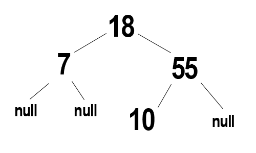
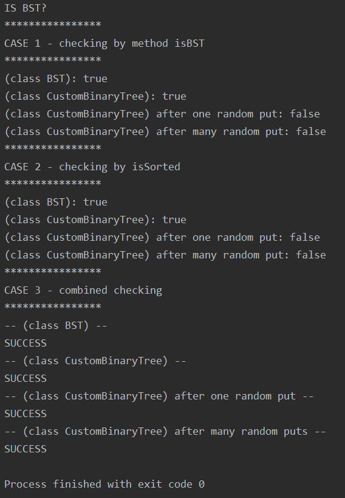
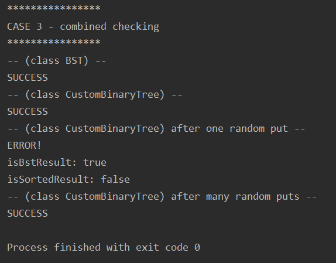

Воронов Вадим ИБ-119
# Лабораторная работа 6.
## Проверка: является ли двоичное дерево деревом бинарного поиска или нет.
Для решения данной задачи я создал специальный класс **CustomBinaryTree**, который отличается от обычного BST тем, что в нем присутствуют методы customPut и customGet.
**customPut** добавляет элемент на случайное свободное место в дереве.
**customGet** выполняет поиск по ключу по всему дереву (даже после одного вызова customPut обычный get может не сработать, так как структура дерева уже может быть нарушена).
### Проверка с помощью isSorted.
В обоих классах (BST и CustomBinaryTree) присутствуют методы для получения списка ключей. Ключи добавляются в лист уже в отсортированном порядке (по возрастанию). Соответственно, если список отсортирован, то и структура дерева правильная.
### Проверка с помощью isBst.
isBst является методом внутри классов CustomBinaryTree и BST.
Метод рекурсивно проверяет каждый узел:
Если ключ вышестоящего узла меньше или равен ключу проверяемого узла, при этом мы находимся на левой ветке, то метод возвращает `false`. Если ключ вышестоящего узла больше или равен ключу проверяемого узла, при этом мы находимся на правой ветке, то метод возвращает тоже `false`.
У этого алгоритма есть один большой минус. Если дерево составлено примерно таким образом:

то метод выдаст значение `true`, что не является верным. Список ключей при этом выглядит так: `{7, 18, 10, 55}`
Поэтому проверка отсортированности списка ключей является более достоверной.
Программа выводит несколько результатов:
* Результат проверки с помощью isBst
* Результат проверки с помощью isSorted
* Комбинированный: проверка и через isBst, и через isSorted. SUCCESS - оба результата совпали. ERROR - результаты не совпали.
### Пример вывода программы:

При появлении несовпадения:

